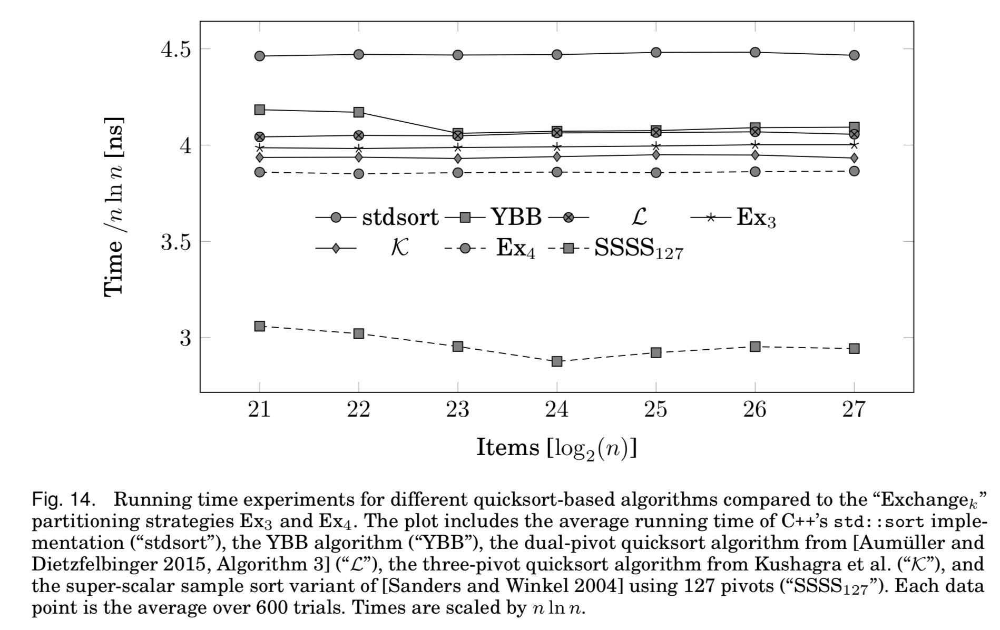

# Multi-Pivot Quicksort

Source code used in the quicksort experiments of the thesis [On the Analysis of
Two Randomized Algorithms: Multi-Pivot Quicksort and Efficient Hash Functions](http://pkqs.net/~tre/aumueller_dissertation.pdf).

## Included Algorithms

The code includes (see [src/algorithms/](src/algorithms/)):
- single pivot quicksort variants
- different dual pivot quicksort variants
- a three-pivot quicksort variant
- different variants of super-scalar sample sort
- a generator for k pivot quicksort using different sampling strategies, see the _ruby-scripts_ subdirectory. If you have ever wondered how a 15-pivot quicksort algorithm looks like, [here it is](https://github.com/maumueller/MultiPivotQuicksort/blob/master/src/algorithms/qs-15%200%200%200%200%200%200%200%200%200%200%200%200%200%200%200%200.h). You might imagine why there is a script for generating the code.

Note that all algorithms are tested on random permutations. They don't take measures to avoid worst-case inputs or somehow adapt to the input.

## Results

A summary plot from our [TALG paper](https://dl.acm.org/citation.cfm?doid=2963102).

## Dependencies

Needs g++, cmake in version >= 2.8, libboost-random and libpapi for performance
measurements. (Enabled by default, can be changed in CMakeLists.txt.)

## How to build

Use the following commands on the top-level directory of the project.

> mkdir build; cd build
> cmake ..
> make

For a release build with optimization flags, use 
> cmake -DCMAKE_BUILD_TYPE=Release

After successful compilation, the executable is located at
build/src/qstest.

## Example Calls

Example calls can be found in the directory _examples_.

## Acknowledgements

Parts of the code were developed with the help of Timo Bingmann and Sebastian Wild.
Basic toolkit to run experiments and measure running times
provided by Timo Bingmann. (http://www.panthema.net)

